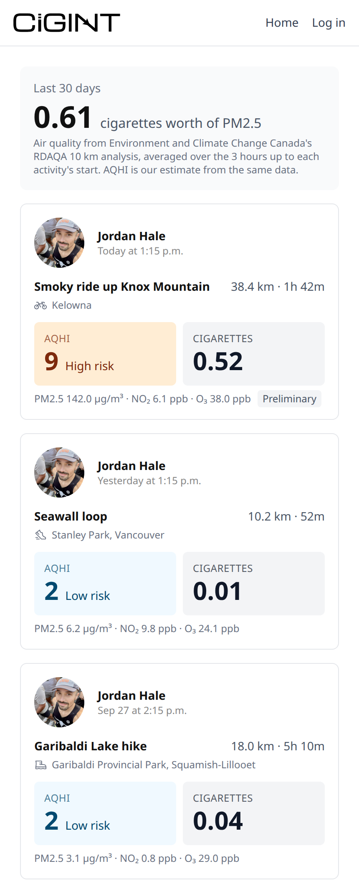

# CIGINT

**How many cigarettes was your run worth?**

CIGINT connects to your Strava account, looks up the air quality where and
when each outdoor activity started, and turns it into an
[Air Quality Health Index](https://www.canada.ca/en/environment-climate-change/services/air-quality-health-index/about.html)
reading and a cigarette-equivalent dose of fine particulate matter (PM2.5).

**Live:** [cigint.justineverett.ca](https://cigint.justineverett.ca)
&nbsp;·&nbsp;
**Demo:** [sample feed, no login](https://cigint.justineverett.ca/demo)
&nbsp;·&nbsp;
[](https://github.com/JustinBEverett/CIGINT/actions/workflows/ci.yml)

<p align="center">
  
</p>

> Strava limits apps like this one to a small number of connected athletes,
> so logging in on the live site may not be open to everyone. The
> [demo feed](https://cigint.justineverett.ca/demo) shows the same
> interface with sample activities.

## What it does

- **Connects to Strava** with OAuth and imports your outdoor activities
  with GPS from roughly the last 30 days.
- **Looks up air quality** for each activity from Environment and Climate
  Change Canada's hourly 10 km air quality analysis (RDAQA): PM2.5, NO₂ and
  O₃, averaged over the 3 hours up to the start.
- **Computes the AQHI** with Health Canada's published formula, and a
  **cigarette equivalent** using Berkeley Earth's rule of thumb that
  breathing 22 µg/m³ of PM2.5 for a day is roughly one cigarette.
- **Shows a Strava-style feed** with sport icons and place names from
  OpenStreetMap, streaming in as the data arrives.
- **Upgrades readings automatically**: a preliminary analysis appears within
  the hour, and the final one replaces it about two hours later.
- **Lets you leave cleanly**: disconnecting revokes access on Strava and
  deletes everything stored about you.

## Tech

Next.js 16 (App Router, React Server Components, streaming with Suspense) ·
React 19 · TypeScript · Tailwind CSS 4 · PostgreSQL with Prisma 8 (Prisma
Next, contract-first) · Vitest · GitHub Actions · Vercel.

## How it works

```
Strava OAuth ─► User / Account / Session (Postgres)
                        │
/activities ─► stored activities render immediately
              ├─ Strava sync (cache-first, 15 min TTL) ─► new cards stream in
              └─ per card, streamed independently:
                   air quality: ECCC RDAQA GRIB2 files ─► 3 h averages ─► AQHI + cigarettes
                   place name:  OpenStreetMap Nominatim, stored once per start point
```

Decisions worth calling out:

- **Auth without a library.** Custom OAuth with a CSRF `state` check and
  database-backed sessions in an httpOnly cookie. The schema separates
  identity (`User`), provider credentials (`Account`) and sessions
  (`Session`), the same shape Auth.js uses, so another login method would be
  a new row rather than new columns.
- **Cache-first sync.** The feed renders from Postgres. Strava is asked for
  new activities at most every 15 minutes, since rate limits are shared by
  every user, with a 48-hour overlap to catch activities uploaded late.
- **Streaming UI.** Stored cards render straight away. The Strava sync and
  each card's air-quality and place-name lookups resolve in their own
  Suspense boundaries, so nothing waits on the slowest piece.
- **Air quality from raw model output.** RDAQA is published as hourly GRIB2
  grids. The app downloads and decodes them server-side (JPEG2000-compressed
  fields), samples the nearest 10 km grid point, and caches the files in
  Next's Data Cache, since a published file never changes.
- **Checked against official readings.** Across 216 station-hours in
  British Columbia during two smoke events, the AQHI computed from the grid
  was within 0.29 of Environment Canada's official station readings on
  average, and in the same risk band 97% of the time. Few of those hours
  were high, and the grid likely reads low during heavy wildfire smoke.

## Running it locally

You need Node 24, pnpm, a PostgreSQL 15+ database, and a
[Strava API application](https://www.strava.com/settings/api).

```bash
pnpm install
cp .env.example .env    # fill in DATABASE_URL and your Strava client id and secret
pnpm db:init            # create the schema in your database
pnpm dev                # http://localhost:3000
```

Strava accepts `localhost` callbacks for development alongside your app's
configured domain, so you can log in locally with the same Strava app.

| Variable | Purpose |
| --- | --- |
| `DATABASE_URL` | PostgreSQL connection string |
| `APP_ORIGIN` | This environment's base URL, used for redirects |
| `STRAVA_CLIENT_ID`, `STRAVA_CLIENT_SECRET` | Your Strava API application |
| `STRAVA_REDIRECT_URI` | `<APP_ORIGIN>/api/strava/callback` |
| `STRAVA_SCOPE` | OAuth scopes, e.g. `read,activity:read_all` |

Other scripts: `pnpm test`, `pnpm lint`, `pnpm build`, and
`pnpm contract:emit` after editing the data contract in
`src/prisma/contract.ts`.

## Project structure

```
src/
  app/          pages and route handlers (App Router)
  components/   UI components (server components unless marked "use client")
  lib/          auth and sessions, Strava sync, air quality, geocoding
  prisma/       data contract, generated types and queries
  proxy.ts      session gate for protected routes
migrations/     Prisma migration history
```

## Testing and CI

Vitest covers the exposure maths, the session gate, Strava paging, date
formatting, sport labels and place-name formatting. On every push and pull
request, GitHub Actions runs lint, type-checking, the tests, a production
build, and a check that the generated database types match the contract.
Vercel deploys `main`.

## Limitations

This is a rough estimate, not a measurement.

- Air quality is read at the start point for the 3 hours before the start,
  not along the route or during the activity.
- Breathing rate isn't taken into account, and exercise increases the dose.
- Coverage is Canada (apart from the high Arctic), the contiguous United
  States (apart from the southern tip of Texas and the Florida Keys) and
  most of Alaska.
- ECCC keeps the hourly analysis online for about 30 days, which sets how
  far back activities can be looked up.

## Roadmap

- Treat Strava as the source of truth: stop storing activities, and keep
  only the air-quality and place-name lookups needed to rebuild the feed.
- Load the feed lazily as you scroll.
- Estimate breathing rate from average heart rate for a dose-weighted
  number.
- Archive the hourly analysis so older activities keep their air quality.
- An About page with the full methodology and sources.

## Data and credits

- **Air quality:** Data Source: Environment and Climate Change Canada,
  [Regional Deterministic Air Quality Analysis](https://eccc-msc.github.io/open-data/msc-data/nwp_rdaqa/readme_rdaqa_en/),
  used under the
  [ECCC Data Servers End-use Licence](https://eccc-msc.github.io/open-data/licence/readme_en/).
- **AQHI formula:** Stieb et al. (2008), *Journal of the Air & Waste
  Management Association* 58(3),
  [doi:10.3155/1047-3289.58.3.435](https://doi.org/10.3155/1047-3289.58.3.435).
- **Cigarette equivalence:** R. A. Muller and E. A. Muller, Berkeley Earth,
  [Air Pollution and Cigarette Equivalence](https://berkeleyearth.org/air-pollution-and-cigarette-equivalence/).
- **Place names:** © [OpenStreetMap contributors](https://www.openstreetmap.org/copyright),
  available under the Open Database Licence, via Nominatim.
- **Activities:** Powered by Strava.

CIGINT isn't affiliated with or endorsed by Strava or Environment and
Climate Change Canada.

## Licence

The code is released under the [MIT Licence](LICENSE). The data sources
above keep their own licences and terms.

Built by [Justin Everett](https://www.justineverett.ca).
